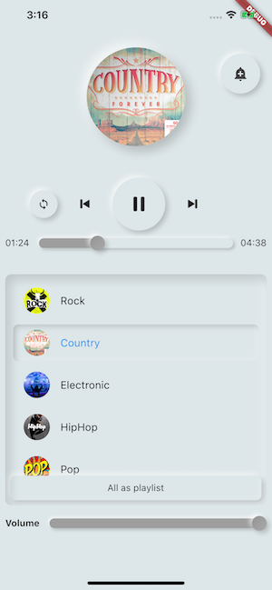
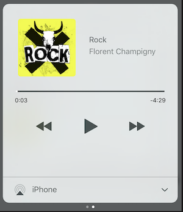

# 🎧 assets_audio_player  🔊

[](
https://pub.dartlang.org/packages/assets_audio_player)

Play music/audio stored in assets files (simultaneously) directly from Flutter (android / ios / web). 

You can also use play audio files from *network* using their url, *radios/livestream* and *local* files

try online :  https://flutter-assets-audio-player.web.app

```yaml
flutter:
  assets:
    - assets/audios/
```

```Dart
AssetsAudioPlayer.newPlayer().open(
    Audio("assets/audios/song1.mp3"),
    autoPlay: true,
);
```

[](https://github.com/florent37/Flutter-AssetsAudioPlayer)
[](https://github.com/florent37/Flutter-AssetsAudioPlayer)

# 📥 Import

```yaml
dependencies:
  assets_audio_player: ^1.5.0
```

**Works with `flutter: ">=1.12.13+hotfix.6 <2.0.0"`, be sure to upgrade your sdk**

<details>
  <summary> 🌐 Web support</summary>
  
And if you wan [web support, enable web](https://flutter.dev/web) then add
```yaml
dependencies:
  assets_audio_player_web: ^1.5.0
```

</details>

You like the package ? buy me a kofi :)

<a href='https://ko-fi.com/A160LCC' target='_blank'></a>

<table>
    <thead>
        <tr>
            <th>Audio Source</th>
            <th>Android</th>
            <th>iOS</th>
            <th>Web</th>
        </tr>
    </thead>
    <tbody>
        <tr>
          <td>Asset file (asset path)</td>
          <td>✅</td>
          <td>✅</td>
          <td>✅</td>
        </tr>
        <tr>
          <td>Network file (url)</td>
          <td>✅</td>
          <td>✅</td>
          <td>✅</td>
        </tr>
        <tr>
          <td>Local file (path)</td>
          <td>✅</td>
          <td>✅</td>
          <td>✅</td>
        </tr>
        <tr>
          <td>Network LiveStream (url)</td>
          <td>✅</td>
          <td>✅</td>
          <td>✅</td>
        </tr>
    </tbody>
</table>


<table>
    <thead>
        <tr>
            <th>Commands</th>
            <th>Android</th>
            <th>iOS</th>
            <th>Web</th>
        </tr>
    </thead>
    <tbody>
        <tr>
          <td>Play</td>
          <td>✅</td>
          <td>✅</td>
          <td>✅</td>
        </tr>
        <tr>
          <td>Pause</td>
          <td>✅</td>
          <td>✅</td>
          <td>✅</td>
        </tr>
        <tr>
          <td>Stop</td>
          <td>✅</td>
          <td>✅</td>
          <td>✅</td>
        </tr>
        <tr>
          <td>Seek(position)</td>
          <td>✅</td>
          <td>✅</td>
          <td>✅</td>
        </tr>
        <tr>
          <td>SeekBy(position)</td>
          <td>✅</td>
          <td>✅</td>
          <td>✅</td>
        </tr>
        <tr>
          <td>Forward(speed)</td>
          <td>✅</td>
          <td>✅</td>
          <td>✅</td>
        </tr>
        <tr>
          <td>Rewind(speed)</td>
          <td>✅</td>
          <td>✅</td>
          <td>✅</td>
        </tr>
        <tr>
          <td>Next</td>
          <td>✅</td>
          <td>✅</td>
          <td>✅</td>
        </tr>
        <tr>
           <td>Prev</td>
           <td>✅</td>
           <td>✅</td>
           <td>✅</td>
        </tr>
    </tbody>
</table>

<table>
    <thead>
        <tr>
            <th>Feature</th>
            <th>Android</th>
            <th>iOS</th>
            <th>Web</th>
        </tr>
    </thead>
    <tbody>
        <tr>
          <td>Multiple players</td>
          <td>✅</td>
          <td>✅</td>
          <td>✅</td>
        </tr>
        <tr>
          <td>Open Playlist</td>
          <td>✅</td>
          <td>✅</td>
          <td>✅</td>
        </tr>
        <tr>
          <td>system notification</td>
          <td>✅</td>
          <td>✅</td>
          <td>🚫</td>
        </tr>
        <tr>
          <td>Respect System silent mode</td>
          <td>✅</td>
          <td>✅</td>
          <td>🚫</td>
        </tr>
        <tr>
          <td>Pause on phone call</td>
          <td>✅</td>
          <td>✅</td>
          <td>🚫</td>
        </tr>
        <tr>
           <td>Audio Widget</td>
           <td>✅</td>
           <td>✅</td>
           <td>✅</td>
        </tr>
    </tbody>
</table>

<table>
    <thead>
        <tr>
            <th>Properties</th>
            <th>Android</th>
            <th>iOS</th>
            <th>Web</th>
        </tr>
    </thead>
    <tbody>
        <tr>
          <td>Loop</td>
          <td>✅</td>
          <td>✅</td>
          <td>✅</td>
        </tr>
        <tr>
          <td>get/set Volume</td>
          <td>✅</td>
          <td>✅</td>
          <td>✅</td>
        </tr>
        <tr>
          <td>get/set Play Speed</td>
          <td>✅</td>
          <td>✅</td>
          <td>✅</td>
        </tr>
    </tbody>
</table>

<table>
    <thead>
        <tr>
            <th>Listeners</th>
            <th>Android</th>
            <th>iOS</th>
            <th>Web</th>
        </tr>
    </thead>
    <tbody>
        <tr>
          <td>Listener onReady(completeDuration)</td>
          <td>✅</td>
          <td>✅</td>
          <td>✅</td>
        </tr>
        <tr>
           <td>Listener currentPosition</td>
           <td>✅</td>
           <td>✅</td>
           <td>✅</td>
        </tr>
        <tr>
          <td>Listener finished</td>
          <td>✅</td>
          <td>✅</td>
          <td>✅</td>
        </tr>
        <tr>
           <td>Listener buffering</td>
           <td>✅</td>
           <td>✅</td>
           <td>✅</td>
        </tr>
        <tr>
          <td>Listener volume</td>
          <td>✅</td>
          <td>✅</td>
          <td>✅</td>
        </tr>
        <tr>
          <td>Listener Play Speed</td>
          <td>✅</td>
          <td>✅</td>
          <td>✅</td>
        </tr>
    </tbody>
</table>

# 📁 Import assets files

No needed to copy songs to a media cache, with assets_audio_player you can open them directly from the assets. 

1. Create an audio directory in your assets (not necessary named "audios")
2. Declare it inside your pubspec.yaml

```yaml
flutter:
  assets:
    - assets/audios/
```

## 🛠️ Getting Started

```Dart
final assetsAudioPlayer = AssetsAudioPlayer();

assetsAudioPlayer.open(
    Audio("assets/audios/song1.mp3"),
);
```

You can also play *network songs* from *url*

```Dart
final assetsAudioPlayer = AssetsAudioPlayer();

try {
    await assetsAudioPlayer.open(
        Audio.network("http://www.mysite.com/myMp3file.mp3"),
    );
} catch (t) {
    //mp3 unreachable
}
```

*LiveStream / Radio* from *url*

**The main difference with network, if you pause/play, on livestream it will resume to present duration**

```Dart
final assetsAudioPlayer = AssetsAudioPlayer();

try {
    await assetsAudioPlayer.open(
        Audio.liveStream(MY_LIVESTREAM_URL),
    );
} catch (t) {
    //stream unreachable
}
```

And play *songs from file*

```Dart
//create a new player
final assetsAudioPlayer = AssetsAudioPlayer();

assetsAudioPlayer.open(
    Audio.file(FILE_URI),
);
```

for file uri, please look at https://pub.dev/packages/path_provider

```Dart
assetsAudioPlayer.playOrPause();
assetsAudioPlayer.play();
assetsAudioPlayer.pause();
```

```Dart
assetsAudioPlayer.seek(Duration to);
assetsAudioPlayer.seekBy(Duration by);
```

```Dart
assetsAudioPlayer.forwardRewind(double speed);
//if positive, forward, if negative, rewind
```

```Dart
assetsAudioPlayer.stop();
```


# Notifications 


[](https://github.com/florent37/Flutter-AssetsAudioPlayer)

[](https://github.com/florent37/Flutter-AssetsAudioPlayer)

on iOS, it will use `MPNowPlayingInfoCenter`

1. Add metas inside your audio

```dart
final audio = Audio("/assets/audio/country.mp3", 
    metas: Metas(
            title:  "Country",
            artist: "Florent Champigny",
            album: "CountryAlbum",
            image: MetasImage.asset("assets/images/country.jpg"), //can be MetasImage.network
          ),
   );
```

2. open with `showNotification: true`

```dart
_player.open(audio, showNotification: true)
```


# ⛓ Play in parallel / simultaneously

You can create new AssetsAudioPlayer using AssetsAudioPlayer.newPlayer(), 
which will play songs in a different native Media Player

This will enable to play two songs simultaneously

You can have as many player as you want !

```dart
///play 3 songs in parallel
AssetsAudioPlayer.newPlayer().open(
    Audio("assets/audios/song1.mp3")
);
AssetsAudioPlayer.newPlayer().open(
    Audio("assets/audios/song2.mp3")
);

//another way, with create, open, play & dispose the player on finish
AssetsAudioPlayer.playAndForget(
    Audio("assets/audios/song3.mp3")
);
```

Each player has an unique generated `id`, you can retrieve or create them manually using 

```dart
final player = AssetsAudioPlayer.withId(id: "MY_UNIQUE_ID");
```

# 🗄️ Playlist
```Dart
assetsAudioPlayer.open(
  Playlist(
    assetAudioPaths: [
      "assets/audios/song1.mp3",
      "assets/audios/song2.mp3"
    ]
  )
);

assetsAudioPlayer.next();
assetsAudioPlayer.prev();
assetsAudioPlayer.playAtIndex(1);
```

## Audio Widget

If you want a more flutter way to play audio, try the `AudioWidget` !

[](https://github.com/florent37/Flutter-AssetsAudioPlayer)

```dart
//inside a stateful widget

bool _play = false;

@override
Widget build(BuildContext context) {
  return Audio.assets(
     path: "assets/audios/country.mp3",
     play: _play,
     child: RaisedButton(
           child: Text(
               _play ? "pause" : "play",
           ),
           onPressed: () {
               setState(() {
                 _play = !_play;
               });
           }
      ),
      onReadyToPlay: (duration) {
          //onReadyToPlay
      },
      onPositionChanged: (current, duration) {
          //onReadyToPlay
      },
  );
}
```

How to 🛑 stop 🛑 the AudioWidget ?

Just remove the Audio from the tree !
Or simply keep `play: false`

## 🎧 Listeners

All listeners exposes Streams 
Using RxDart, AssetsAudioPlayer exposes some listeners as ValueObservable (Observable that provides synchronous access to the last emitted item);

### 🎵 Current song
```Dart
//The current playing audio, filled with the total song duration
assetsAudioPlayer.current //ValueObservable<PlayingAudio>

//Retrieve directly the current played asset
final PlayingAudio playing = assetsAudioPlayer.current.value;

//Listen to the current playing song
assetsAudioPlayer.current.listen((playingAudio){
    final asset = playingAudio.assetAudio;
    final songDuration = playingAudio.duration;
})
```

### ⌛ Current song duration

```Dart
//Listen to the current playing song
final duration = assetsAudioPlayer.current.value.duration;
```

### ⏳ Current position (in seconds)

```Dart
assetsAudioPlayer.currentPosition //ValueObservable<Duration>

//retrieve directly the current song position
final Duration position = assetsAudioPlayer.currentPosition.value;

return StreamBuilder(
    stream: assetsAudioPlayer.currentPosition,
    builder: (context, asyncSnapshot) {
        final Duration duration = asyncSnapshot.data;
        return Text(duration.toString());  
    }),
```

or use a PlayerBuilder !

```dart
PlayerBuilder.currentPosition(
     player: _assetsAudioPlayer,
     builder: (context, duration) {
       return Text(duration.toString());  
     }
)
```

### ▶ IsPlaying
boolean observable representing the current mediaplayer playing state
```Dart
assetsAudioPlayer.isPlaying // ValueObservable<bool>

//retrieve directly the current player state
final bool playing = assetsAudioPlayer.isPlaying.value;

//will follow the AssetsAudioPlayer playing state
return StreamBuilder(
    stream: assetsAudioPlayer.isPlaying,
    builder: (context, asyncSnapshot) {
        final bool isPlaying = asyncSnapshot.data;
        return Text(isPlaying ? "Pause" : "Play");  
    }),
```

or use a PlayerBuilder !

```dart
PlayerBuilder.isPlaying(
     player: _assetsAudioPlayer,
     builder: (context, isPlaying) {
       return Text(isPlaying ? "Pause" : "Play");  
     }
)
```

### 🔊 Volume

Change the volume (between 0.0 & 1.0)
```Dart
assetsAudioPlayer.setVolume(0.5);
```

The media player can follow the system "volume mode" (vibrate, muted, normal)
Simply set the `respectSilentMode` optional parameter as `true`

```dart
_player.open(PLAYABLE, respectSilentMode: true);
```

https://developer.android.com/reference/android/media/AudioManager.html?hl=fr#getRingerMode()

https://developer.apple.com/documentation/avfoundation/avaudiosessioncategorysoloambient


Listen the volume

```dart
return StreamBuilder(
    stream: assetsAudioPlayer.volume,
    builder: (context, asyncSnapshot) {
        final double volume = asyncSnapshot.data;
        return Text("volume : $volume");  
    }),
```

or use a PlayerBuilder !

```dart
PlayerBuilder.volume(
     player: _assetsAudioPlayer,
     builder: (context, volume) {
       return Text("volume : $volume");
     }
)
```

### ✋ Finished

Called when the current song has finished to play, 

it gives the Playing audio that just finished

```Dart
assetsAudioPlayer.playlistAudioFinished //ValueObservable<Playing>

assetsAudioPlayer.playlistAudioFinished.listen((Playing playing){
    
})
```

Called when the complete playlist has finished to play

```Dart
assetsAudioPlayer.playlistFinished //ValueObservable<bool>

assetsAudioPlayer.playlistFinished.listen((finished){
    
})
```

### 🔁 Looping

```Dart
final bool isLooping = assetsAudioPlayer.loop; //true / false

assetsAudioPlayer.loop = true; //set loop as true

assetsAudioPlayer.isLooping.listen((loop){
    //listen to loop
})

assetsAudioPlayer.toggleLoop(); //toggle the value of looping
```

# Network Policies (android/iOS)

Android only allow HTTPS calls, you will have an error if you're using HTTP, 
don't forget to add INTERNET permission and seet `usesCleartextTraffic="true"` in your **AndroidManifest.xml**

```
<?xml version="1.0" encoding="utf-8"?>
<manifest ...>
    <uses-permission android:name="android.permission.INTERNET" />
    <application
        ...
        android:usesCleartextTraffic="true"
        ...>
        ...
    </application>
</manifest>
```

iOS only allow HTTPS calls, you will have an error if you're using HTTP, 
don't forget to edit your **info.plist** and set `NSAppTransportSecurity` to `NSAllowsArbitraryLoads`

```
<key>NSAppTransportSecurity</key>
<dict>
    <key>NSAllowsArbitraryLoads</key>
    <true/>
</dict>
```

# 🌐 Web Support

Web support is using [import_js_library](https://pub.dev/packages/import_js_library) to import the [Howler.js library](https://howlerjs.com/)

The flutter wrapper of Howler has been exported in another package : https://github.com/florent37/flutter_web_howl

# 🎶 Musics

All musics used in the samples came from https://www.freemusicarchive.org/
